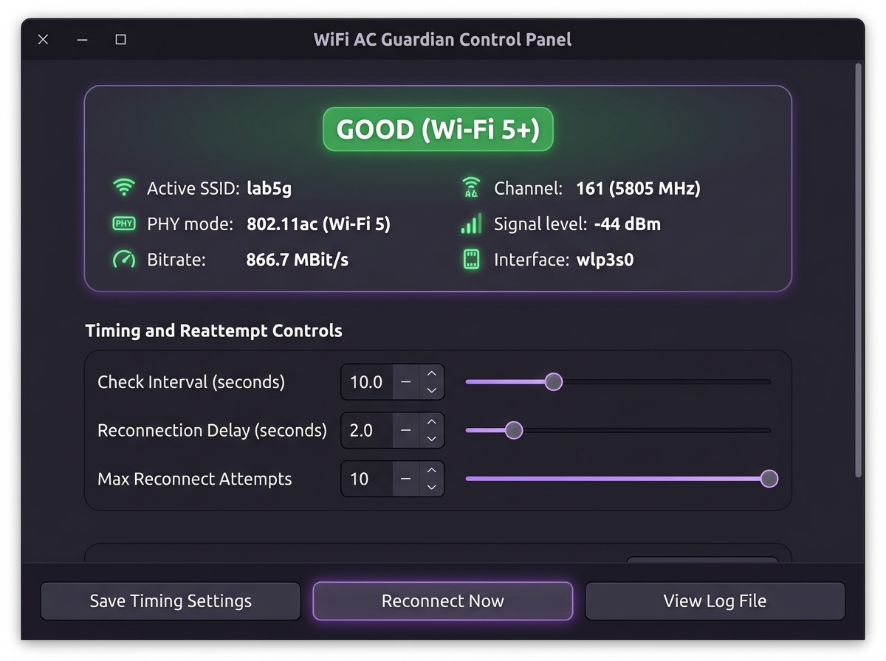
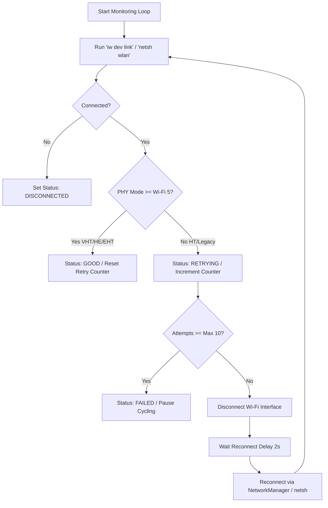

# WiFi AC Guardian 🛡️📶

[](https://opensource.org/licenses/MIT)
[](https://python.org)
[](https://ubuntu.com)
[]()

**WiFi AC Guardian** is an open-source, production-grade Linux & Windows desktop service designed to continuously monitor Wi-Fi physical layer (PHY) negotiation modes. If your connection falls back to **Wi-Fi 4 (802.11n / HT)** or another slower legacy mode, WiFi AC Guardian automatically disconnects and re-establishes the connection via NetworkManager / `netsh` until **Wi-Fi 5 (802.11ac / VHT)**, **Wi-Fi 6 (802.11ax / HE)**, or **Wi-Fi 7 (802.11be / EHT)** is active.

---

## 🖼️ Desktop UI Screenshot



---

## 🌟 Key Features

- **Automatic Interface Discovery**: Auto-detects wireless network devices (`wlp3s0`, `wlan0`, `Wi-Fi`).
- **Continuous 10-Second Polling**: Evaluates link parameters every 10 seconds.
- **Wi-Fi 5+ Protocol Enforcement**: Considers connection **GOOD** if PHY mode is:
  - **Wi-Fi 5** (`802.11ac` / `VHT`)
  - **Wi-Fi 6 / 6E** (`802.11ax` / `HE`)
  - **Wi-Fi 7** (`802.11be` / `EHT`)
- **Automated Downgrade Mitigation**:
  - Detects downgrade to Wi-Fi 4 (`802.11n` / HT).
  - Logs ISO-timestamped warnings to `~/wifi_ac_guardian.log`.
  - Disconnects Wi-Fi interface, waits 2 seconds, and reconnects.
  - Retries up to **10 attempts** before flagging error state.
- **Interactive Control Panel UI**:
  - Real-time connection badge (**GOOD**, **DOWNGRADE**, **DISCONNECTED**).
  - Selectors for **Check Interval (2s-60s)** and **Reconnection Delay (0.5s-10s)**.
  - Checkboxes to toggle **Desktop Notifications** and **Pause Protection**.
- **System Tray Integration**: Live color status icons (Green, Yellow, Red, Gray) with context menu.
- **Multi-Platform Support**: Works natively on **Ubuntu 22.04+** and **Windows 11**.

---

## 🏗️ Architecture & Workflow



---

## 🚀 Quick Start & Installation

### Option A: Native `.deb` Installer (Ubuntu)
```bash
sudo dpkg -i wifi-ac-guardian_1.0.0_all.deb
```
Or via apt:
```bash
sudo apt install ./wifi-ac-guardian_1.0.0_all.deb
```

### Option B: Automated Shell Installer
```bash
git clone https://github.com/zohaibjaved/wifi-ac-guardian.git
cd wifi-ac-guardian
./install.sh
```

---

## 💻 CLI Options

```bash
# Launch Graphical Control Panel UI
wifi-ac-guardian --gui

# Show Instant Connection Status Report
wifi-ac-guardian --status

# Run Continuous Background Monitoring Daemon
wifi-ac-guardian --daemon
```

---

## 🧪 Unit Tests

Run the test suite using `unittest` or `pytest`:

```bash
python3 -m unittest discover -s tests -p "test_*.py"
```

---

## 🤝 Contributing

Contributions are welcome! Please see [CONTRIBUTING.md](CONTRIBUTING.md) and [CODE_OF_CONDUCT.md](CODE_OF_CONDUCT.md).

---

## 📄 License

Distributed under the MIT License. See [LICENSE](LICENSE) for details.
