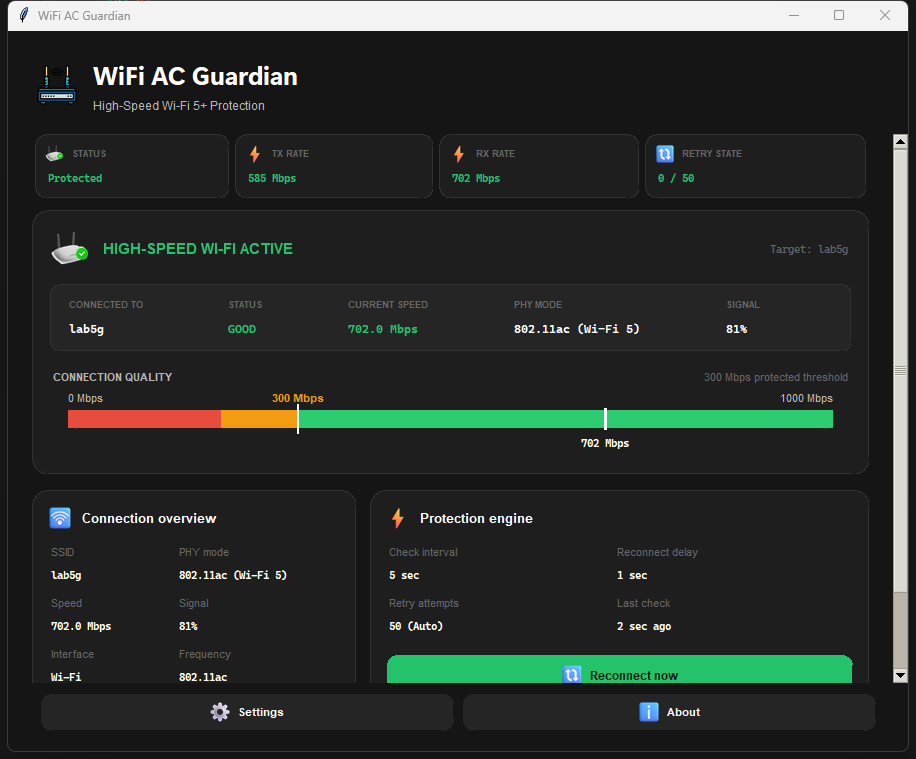

# 🛡️ WiFi AC Guardian

**Automatic Wi-Fi 5+ protection for Windows 11.**

WiFi AC Guardian is a background utility that keeps your wireless connection locked at
**Wi-Fi 5 (802.11ac)**, **Wi-Fi 6 (802.11ax)**, or **Wi-Fi 7 (802.11be)** with a link rate above
**300 Mbps**. When Windows silently downgrades the link to Wi-Fi 4, the bitrate drops to 300 Mbps or
below, or the adapter attaches to the wrong SSID, the Guardian performs a hardware Wi-Fi adapter
reset and reconnects — without you noticing anything happened.

**Version 1.0.0** · Windows 11 · Python ≥ 3.8

---

## Table of Contents

- [Overview](#overview)
- [Features](#features)
- [Screenshots](#screenshots)
- [Architecture](#architecture)
- [Installation](#installation)
- [Running](#running)
- [Configuration](#configuration)
- [Project Structure](#project-structure)
- [Development Workflow](#development-workflow)
- [Spec Kit Workflow](#spec-kit-workflow)
- [Roadmap](#roadmap)
- [Contributing](#contributing)
- [License](#license)

---

## Overview

### The Problem

Some routers — the PTCL Huawei HG8141V5 is the reference case — intermittently drop a healthy
802.11ac connection down to 802.11n, or cap the link at exactly 300 Mbps. Windows does not surface
this. The connection stays "connected," the Wi-Fi icon shows full bars, and throughput quietly
collapses. The only reliable fix is toggling the adapter radio, which most people discover by
accident after minutes of confusion.

### The Solution

The Guardian polls the wireless link continuously. When it detects a downgrade, it resets the adapter
radio and reconnects to the target SSID — typically restoring full speed in under a minute, with no
user interaction.

### What It Is Not

This is a **Wi-Fi 5+ enforcer**, not a diagnostic suite. It is deliberately not a network analyzer,
a bandwidth tester, a router admin tool, or a VPN. It does one job.

---

## Features

### Continuous Protection

- Polls link quality on a configurable interval (default 15s, range 2–120s)
- Strict quality rule — a connection is healthy only if PHY mode is **802.11ac/ax/be** *and* TX or RX
  rate exceeds **300 Mbps**
- Hardware radio reset via the WinRT Radio API, with `Disable/Enable-NetAdapter` and `netsh`
  fallbacks
- Automatic reconnect to the target SSID after every reset
- Configurable retry attempts with a 60-second cooldown (default: unlimited)
- Runs in user mode — **no UAC elevation required**

### Standby Mode

When connected to a network other than the protected target — a backup router, a phone hotspot, a
café — the Guardian enters **Standby** (blue). Resets are suspended so a legitimately slower
connection is never interrupted, while a background scan watches for the primary network and offers
one-click failback.

### Dashboard

- Four KPI cards: Status, TX Rate, RX Rate, Retry State
- Full-width status card with hero router artwork that changes per state
- `SegmentedSpeedBar` quality meter with red / orange / green zones and a 300 Mbps threshold marker
- Connection Overview — SSID, BSSID, PHY mode, signal strength, channel
- Protection Engine panel with Reconnect now and Stop protection
- Responsive layout, minimum 760 × 600, fully maximizable

### System Tray

- Four visual states: 🟢 Good · 🟡 Restoring · 🔴 Downgraded · 🔵 Standby
- Menu: Open Dashboard · Reconnect now · Stop/Start Protection · Exit
- Optional Windows toast notifications

### Reliability

- Single-instance enforcement — double-clicking the shortcut focuses the running window instead of
  spawning a second process
- Rotating log file for every engine event
- Optional Windows startup registration
- Full CLI for scripted and headless use

---

## Screenshots

### Dashboard



*Live dashboard showing a protected `lab5g` connection: 802.11ac, 702 Mbps down, 585 Mbps up,
81% signal.*

### Additional Screenshots

<!-- Add as the interface evolves -->

| View | Screenshot |
|------|-----------|
| Settings panel | _pending_ |
| System tray menu | _pending_ |
| Standby state | _pending_ |
| Reset in progress | _pending_ |
| About dialog | _pending_ |

---

## Architecture

### High-Level Flow

```
┌─────────────────────────────────────────────────────────────┐
│                     Presentation Layer                       │
│   ui.py (Tkinter dashboard)      tray.py (pystray applet)   │
└───────────────────────────┬─────────────────────────────────┘
                            │  state updates via after(0, …)
┌───────────────────────────┴─────────────────────────────────┐
│                      Business Logic (core/)                  │
│                                                              │
│   guardian.py   ── monitoring loop, state machine            │
│   models.py     ── quality rules, config, enums              │
│   detector_win.py    ── netsh parsing, link detection        │
│   reconnector_win.py ── hardware radio reset                 │
│   notifier_win.py    ── toast notifications                  │
└───────────────────────────┬─────────────────────────────────┘
                            │  subprocess, CREATE_NO_WINDOW
┌───────────────────────────┴─────────────────────────────────┐
│                      Windows Platform                        │
│   netsh wlan  ·  WinRT Radio API  ·  PowerShell cmdlets     │
└─────────────────────────────────────────────────────────────┘
```

`core/` imports nothing from the UI layer. This separation is a constitutional requirement, not a
convention.

### Detection Cycle

```
poll interval elapsed
        │
        ▼
netsh wlan show interfaces ──► parse SSID, BSSID, PHY mode, TX/RX rate, signal
        │
        ▼
   on target SSID? ──no──► STANDBY (blue) — suspend resets, scan for target
        │ yes
        ▼
   802.11ac/ax/be AND rate > 300 Mbps?
        │                    │
       yes                   no
        │                    │
        ▼                    ▼
   GOOD (green)         DOWNGRADED (red) ──► trigger reset
```

### Reset Sequence

| Step | Action | Duration |
|------|--------|----------|
| 1 | Radio OFF — WinRT `SetStateAsync(Off)` | — |
| 2 | Wait for radio power-down | 15s |
| 3 | Radio ON — WinRT `SetStateAsync(On)` | — |
| 4 | Wait for driver and radio stabilization | 15s |
| 5 | `netsh wlan connect name="<SSID>"` | — |
| 6 | Poll for link stabilization | up to 15s |

Total worst case: ~45 seconds. Fallback chain if the WinRT path is unavailable:
`Disable/Enable-NetAdapter` → `netsh interface set interface`.

### Architecture Invariants

Four rules that must hold in any change. Each maps to a real, user-visible failure:

| Invariant | Failure if broken |
|-----------|-------------------|
| `CREATE_NO_WINDOW` on every subprocess call | Console window flashes every poll |
| `widget.after(0, …)` for background-thread UI updates | Intermittent Tkinter crashes |
| Tray icon reassigned only on state change | GDI handle leak; tray icon disappears |
| Single-instance enforcement via `127.0.0.1:39145` | Two engines fight over the adapter |

---

## Installation

### Requirements

- Windows 11 (Windows 10 compatible)
- Python 3.8 or newer
- A wireless adapter supporting 802.11ac or better

### Option 1 — Automated Installer (recommended)

Double-click **`install.bat`**. It will:

1. Install the package and dependencies via `pip`
2. Create a desktop shortcut
3. Register a Windows startup shortcut
4. Launch the dashboard

### Option 2 — Manual

```powershell
python -m pip install .
```

### Dependencies

| Package | Version | Purpose |
|---------|---------|---------|
| `pystray` | ≥ 0.19.0 | System tray applet |
| `Pillow` | ≥ 9.0.0 | Icon generation and asset loading |

Tkinter ships with CPython — no separate install needed.

### Uninstall

Double-click **`uninstall.bat`**, or:

```powershell
python -m pip uninstall -y wifi-ac-guardian-win
```

---

## Running

### Dashboard

```powershell
pythonw -m wifi_ac_guardian_win --gui
```

`pythonw` suppresses the console window. Use `python` instead when you want to see stdout.

### Background Daemon

```powershell
pythonw -m wifi_ac_guardian_win --daemon
```

### Status Report

```powershell
python -m wifi_ac_guardian_win --status
```

### Manual Reset

```powershell
python -m wifi_ac_guardian_win --reconnect
```

### CLI Reference

| Flag | Short | Description | Default |
|------|-------|-------------|---------|
| `--gui` | `-g` | Launch the dashboard | — |
| `--daemon` | `-d` | Run background monitoring with tray applet | — |
| `--status` | `-s` | Print a status report and exit | — |
| `--reconnect` | `-r` | Force an immediate adapter reset | — |
| `--target-ssid` | — | Lock onto a specific SSID | from config |
| `--interface` | `-i` | Wireless adapter name | `Wi-Fi` |
| `--interval` | `-t` | Poll interval in seconds | `15.0` |
| `--max-attempts` | — | Retry limit (`0` = unlimited) | `0` |

### Stop All Instances

```powershell
Get-Process python*, wifi-ac-guardian* -ErrorAction SilentlyContinue | Stop-Process -Force
```

---

## Configuration

Settings persist to `%APPDATA%\wifi-ac-guardian\config.json`.

```json
{
    "interface": "Wi-Fi",
    "target_ssid": "lab5g",
    "check_interval": 15.0,
    "reconnect_delay": 15.0,
    "max_attempts": 0,
    "log_file_path": "C:\\Users\\<user>\\wifi_ac_guardian_win.log",
    "enable_notifications": false,
    "enable_tray": true,
    "start_minimized": false,
    "is_paused": false
}
```

| Key | Type | Range | Description |
|-----|------|-------|-------------|
| `interface` | string | — | Wireless adapter name |
| `target_ssid` | string | — | Protected network |
| `check_interval` | float | 2.0 – 120.0 | Seconds between polls |
| `reconnect_delay` | float | 1.0 – 60.0 | Seconds to wait during reset |
| `max_attempts` | int | 0+ | Retry limit; `0` = unlimited |
| `enable_notifications` | bool | — | Windows toast notifications |
| `enable_tray` | bool | — | System tray applet |
| `start_minimized` | bool | — | Start hidden in tray |
| `is_paused` | bool | — | Protection suspended |

**Log file**: `%USERPROFILE%\wifi_ac_guardian_win.log`

---

## Project Structure

```
WiFi_AC_Guardian_Windows/
├── wifi_ac_guardian_win/       # Application package
│   ├── cli.py                  # Entry point, argument parsing
│   ├── config.py               # JSON persistence, autostart shortcut
│   ├── icons.py                # Tray icon generation
│   ├── logger.py               # Rotating file + stream logging
│   ├── single_instance.py      # Loopback IPC (127.0.0.1:39145)
│   ├── tray.py                 # System tray applet
│   ├── ui.py                   # Tkinter dashboard
│   ├── core/                   # Business logic — no UI imports
│   │   ├── models.py           # Quality rules, config, enums
│   │   ├── detector_win.py     # netsh parsing
│   │   ├── guardian.py         # Monitoring loop
│   │   ├── reconnector_win.py  # Hardware reset engine
│   │   └── notifier_win.py     # Toast notifications
│   └── assets/                 # Icons and status artwork
├── tests/                      # Unit tests
├── scripts/                    # Developer tooling
│   └── end_session.py          # End-of-session checkpoint
├── specs/                      # Feature specifications
├── docs/                       # Project memory
│   ├── DECISIONS.md            # Engineering decision log
│   ├── ROADMAP.md              # Version roadmap
│   ├── SESSION_LOG.md          # Engineering journal
│   ├── GITHUB_SETUP.md         # Remote configuration
│   ├── START_OF_SESSION_CHECKLIST.md
│   └── END_OF_SESSION_CHECKLIST.md
├── history/
│   ├── prompts/                # Prompt History Records
│   └── adr/                    # Architecture Decision Records
├── .specify/memory/constitution.md
├── PROJECT_STATUS.md           # Current state
├── CONTRIBUTING.md             # Development guide
└── README.md
```

---

## Development Workflow

### Verification Gates

Both must pass before any commit:

```powershell
python -m compileall -q wifi_ac_guardian_win   # syntax
python -m pytest -q                            # tests (currently 6, all passing)
```

### Session Discipline

Project context lives in files, not chat history — any assistant or developer can pick the project up
mid-stream.

**Starting**: work through `docs/START_OF_SESSION_CHECKLIST.md`. At minimum read `PROJECT_STATUS.md`,
the top entry of `docs/SESSION_LOG.md`, and the constitution.

**Ending**: work through `docs/END_OF_SESSION_CHECKLIST.md`, or run:

```powershell
python scripts/end_session.py --append-log
```

The script refreshes the status timestamp, appends a session-log stub, verifies the memory documents
exist, warns when they were not updated, and prints repository state. It writes only to
`PROJECT_STATUS.md` and `docs/SESSION_LOG.md`.

### Project Memory

| Document | Answers |
|----------|---------|
| `PROJECT_STATUS.md` | Where is the project right now? |
| `docs/DECISIONS.md` | Why was it built this way? |
| `docs/SESSION_LOG.md` | What happened, session by session? |
| `docs/ROADMAP.md` | Where is it going? |
| `.specify/memory/constitution.md` | What are the rules? |

### Commit Style

```
<type>: <summary>
```

Types: `feat` · `fix` · `docs` · `style` · `refactor` · `test` · `chore`

See [CONTRIBUTING.md](./CONTRIBUTING.md) for the full standard.

---

## Spec Kit Workflow

Development follows Spec-Driven Development. Every feature begins with a written specification.

```
Constitution  →  Spec  →  Plan  →  Tasks  →  Implement  →  Verify  →  Document  →  Commit
```

| Command | Produces |
|---------|----------|
| `/sp.constitution` | Governing principles |
| `/sp.specify` | `specs/<feature>/spec.md` |
| `/sp.clarify` | Resolves gaps in the spec |
| `/sp.plan` | `specs/<feature>/plan.md` with a Constitution Check gate |
| `/sp.tasks` | `specs/<feature>/tasks.md` |
| `/sp.implement` | Code |
| `/sp.adr` | Architecture Decision Record |

### Constitution

Ten principles govern every change. In brief:

1. **User First** — clarity over jargon
2. **Zero Feature Regression** — nothing removed without approval
3. **Premium Desktop Experience** — PowerToys / Docker Desktop as the bar
4. **Beautiful Simplicity** — less clutter, stronger hierarchy
5. **Professional Engineering** — spec first, small commits
6. **Performance First** — responsiveness over effects
7. **Accessibility** — contrast, keyboard navigation, focus states
8. **Consistency** — one design language
9. **Reliability** — the Guardian must feel dependable
10. **Code Quality** — minimal duplication, clear separation

Full text: [`.specify/memory/constitution.md`](./.specify/memory/constitution.md)

---

## Roadmap

### v1.0.0 — Core Protection ✅ Shipped

Dashboard, protection engine, settings, system tray, CLI, single-instance enforcement, logging,
installer.

### v1.1.0 — Premium Polish 📋 Next

Presentation only — no engine changes.

- Design token module — palette, spacing scale, type ramp extracted from `ui.py`
- Terminology pass — "Upload / Download Link Speed" replacing "TX / RX Rate"
- Animated state transitions and speed-bar movement
- Connection timeline showing quality history and reset events
- Richer notifications with configurable triggers
- Accessibility pass — keyboard navigation, focus states, verified contrast

### v2.0.0 — Platform Maturity 💡 Planned

- Auto-update with release notes
- Diagnostics — log viewer, adapter capability report, reset statistics
- Signed MSI installer replacing `install.bat`
- Multi-adapter support

### Future Ideas 💡

Configurable quality thresholds · multi-SSID priority list · scheduled protection windows ·
router-specific profiles · portable mode · localization · light theme · Ubuntu port

Full detail with scope boundaries: [`docs/ROADMAP.md`](./docs/ROADMAP.md)

---

## Contributing

Read [CONTRIBUTING.md](./CONTRIBUTING.md) before making changes. It covers project philosophy, the
Spec-Driven Development workflow, branch strategy, commit style, documentation requirements, and
coding standards.

**Quick orientation**

1. Read `PROJECT_STATUS.md` and the constitution
2. Work through `docs/START_OF_SESSION_CHECKLIST.md`
3. Branch: `git checkout -b NNN-feature-name`
4. Run both verification gates before committing
5. Update the project memory documents
6. Work through `docs/END_OF_SESSION_CHECKLIST.md`

**Non-negotiable**: no existing functionality is removed without explicit approval (Principle II),
and the four architecture invariants hold in every change.

---

## Future Plans

The near-term focus is closing the gap between the current interface and the bar set by Principle III
— matching the polish of PowerToys, Docker Desktop, and Windows 11 itself. That starts with
extracting a real design token system so consistency becomes mechanically checkable rather than
aspirational.

Longer term, the Guardian should stop being a single-machine tool: signed installers, auto-updates,
multi-adapter support, and eventually a Linux port for the same class of router bug.

One thing will not change — the Guardian does one job. Feature requests that turn it into a general
network utility will be declined and recorded in `docs/ROADMAP.md` under out-of-scope.

---

## License

Antigravity Engineering — All Rights Reserved.

---

## Credits

**Creator & Lead Developer**: Zohaib Javed

Built with Python, Tkinter, pystray, and Pillow. Iconography from Microsoft Fluent UI 3D emoji.

---

<div align="center">

**[Documentation](./docs) · [Contributing](./CONTRIBUTING.md) · [Roadmap](./docs/ROADMAP.md) · [Constitution](./.specify/memory/constitution.md)**

</div>
